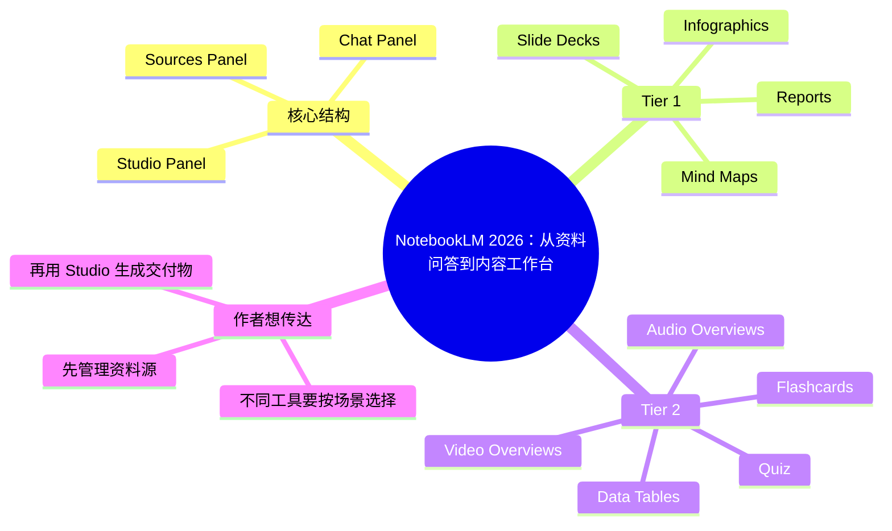

# NotebookLM Changed Completely: Here's What Matters (in 2026)

- 作者：Jeff Su
- 发布时间：2026-03-17
- 视频链接：https://www.youtube.com/watch?v=_uXnyhrqmsU
- 信息边界：当前环境未获取到完整字幕。本摘要基于公开视频描述、章节和元数据生成。

## 快速理解

一句话结论：这期是 NotebookLM 2026 版能力重排，作者重点讲如何从资料源生成报告、幻灯片、信息图、思维导图和其他可交付内容。

简述：Jeff Su 把 NotebookLM 拆成三栏：Sources、Chat、Studio。然后重点评估 Studio 面板里的工具，把 Reports、Slide Decks、Infographics、Mind Maps 放进 Tier 1，把 Data Tables、Video Overviews、Quiz、Flashcards、Audio Overviews 等放进更情境化的 Tier 2。

为什么值得关注：NotebookLM 正在从“基于资料问答”变成“基于资料生成工作成果”的工具。它不只是帮你理解资料，也开始帮你把资料转成报告、PPT、信息图和社媒视觉。

建议行动：

- 重点试 Reports、Slide Decks、Infographics、Mind Maps。
- 把 NotebookLM 当作 source-grounded content studio，而不是普通聊天工具。
- 对 Video / Audio / Quiz / Flashcards 保持场景化使用，不必每次都用。

## 思维导图

## 分节理解

### Chapter 1 · 00:00 - 02:05 · NotebookLM 的核心优势

上下文摘要：开头先介绍 NotebookLM 的变化和核心优势。

作者观点：作者想先把 NotebookLM 和普通聊天工具区分开。它的优势不是泛泛回答，而是围绕你提供的 sources 工作。作者希望观众先理解这个前提：NotebookLM 的输出质量取决于资料源质量，后面的报告、PPT、信息图和思维导图都建立在 source-grounded 的基础上。

原文线索：`Core Advantage`

### Chapter 2 · 02:05 - 07:51 · Sources Panel 和 Chat Panel

上下文摘要：作者先讲资料源面板，再讲聊天面板。

作者观点：作者把 Sources Panel 放在前面，是因为它是 NotebookLM 的底座。资料放得好，后面的问答和生成才有意义。Chat Panel 则是理解资料、追问细节、探索观点的入口。作者的思路是：先把资料组织好，再用对话理解资料，最后才用 Studio 产出内容。

原文线索：`Sources Panel` / `Chat Panel`

### Chapter 3 · 07:51 - 13:56 · Tier 1 Studio 工具

上下文摘要：作者把 Reports、Slide Decks、Infographics、Mind Maps 评为最值得优先使用的 Studio 工具。

作者观点：作者认为这些工具的价值最高，因为它们能把资料直接变成可交付内容。Reports 适合结构化输出；Slide Decks 适合汇报；Infographics 适合视觉解释；Mind Maps 适合建立全局结构。作者想让观众优先掌握这些高频、高价值工具，而不是被所有新功能分散注意力。

原文线索：`Tier 1 Tools`

### Chapter 4 · 15:07 - 19:14 · Tier 2 工具和使用场景

上下文摘要：后段讲 Data Tables、Video Overviews、Quiz、Flashcards、Audio Overviews 等工具。

作者观点：作者不是说这些工具没用，而是认为它们更依赖场景。Data Tables 适合结构化比较；Video Overviews 和 Audio Overviews 适合把资料变成更易消费的媒体；Quiz 和 Flashcards 更适合学习复习。作者想提醒观众：不要因为功能多就全部使用，而是根据输出目标选择工具。

原文线索：`Tier 2 Tools`

### Chapter 5 · 19:50 - 结束 · 高阶工作流

上下文摘要：结尾进入高级工作流和用例。

作者观点：作者最后想表达的是，NotebookLM 的真正价值不在单个按钮，而在工作流组合。你可以先用 sources 建立资料边界，再用 chat 澄清理解，最后用 Studio 生成报告、PPT 或视觉稿。作者希望观众把 NotebookLM 当作一个资料驱动的内容工作台，而不是一个孤立的 AI 小工具。

原文线索：`Advanced NotebookLM Workflows`

## 关键工具 / 产品

- NotebookLM
- Reports
- Slide Decks
- Infographics
- Mind Maps
- Data Tables
- Video Overviews
- Audio Overviews

