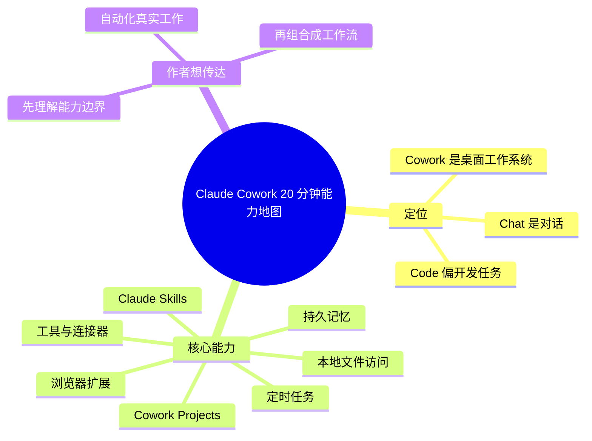

# Learn 80% of Claude Cowork in Under 20 Minutes

- 作者：Jeff Su
- 发布时间：2026-04-07
- 视频链接：https://www.youtube.com/watch?v=z9rdrNrkvDY
- 信息边界：当前环境未获取到完整字幕。本摘要基于公开视频描述、章节和元数据生成。

## 快速理解

一句话结论：这期是 Claude Cowork 的能力地图，作者想让观众先掌握 7 个核心能力，再开始自动化真实工作。

简述：视频把 Claude Chat、Claude Cowork、Claude Code 区分开，然后按能力讲解 Cowork：本地文件访问、持久记忆、工具和连接器、Skills、Projects、浏览器扩展和定时任务。它不是单个工作流教程，更像一份 Claude Cowork 入门路线图。

为什么值得关注：如果上一期讲“如何组织自己的 AI 工作空间”，这期讲的是“Claude Cowork 这个产品到底有哪些工作能力”。它帮助你判断 Claude Cowork 是否已经从聊天工具变成桌面生产力系统。

建议行动：

- 先理解 7 个能力，不要一上来就照抄模板。
- 重点关注本地文件访问、持久记忆、Skills、定时任务这四项。
- 把它当成 Claude Cowork 功能地图，而不是深度技术教程。

## 思维导图

## 分节理解

### Chapter 1 · 00:00 - 02:19 · Claude Chat、Cowork、Code 的区别

上下文摘要：视频开头先做产品定位，帮助观众区分 Claude 的不同使用入口。

作者观点：作者想先解决一个认知问题：很多人只知道 Claude Chat，但不知道 Cowork 和 Code 分别适合什么。作者的安排是先划清边界，再讲能力，避免观众把 Cowork 当作“更复杂的聊天窗口”。他希望你把 Cowork 看成电脑上的生产力系统，把 Code 看成更偏开发场景的工具。

原文线索：`Claude Chat, Cowork, Code`

### Chapter 2 · 02:19 - 08:44 · 基础设置、本地文件访问和持久记忆

上下文摘要：作者先讲 essential settings，然后进入本地文件访问和 persistent memory。

作者观点：作者认为 Cowork 之所以不同，是因为它能接触你的本地工作材料，并且能保存持续有效的记忆。本地文件访问让 Claude 不再只依赖你复制粘贴；持久记忆让 Claude 不必每次重新理解你的偏好和背景。作者把这两项放在前面，是因为它们决定 Cowork 能不能处理真实工作。

原文线索：`local file access, persistent memory`

### Chapter 3 · 08:44 - 14:26 · 工具、连接器和 Skills

上下文摘要：中段讲 Cowork 如何通过工具、连接器和 Skills 扩展能力。

作者观点：作者想表达，Cowork 的关键不是单次回答，而是能把外部服务、可复用技能和具体任务组合起来。连接器让 Claude 接触更多工作系统；Skills 让某类任务变成可复用能力。作者希望观众意识到，AI 自动化不是靠一次 prompt，而是靠能力模块的组合。

原文线索：`Tools & Connectors` / `Claude Skills`

### Chapter 4 · 14:26 - 16:44 · Projects、浏览器扩展和定时任务

上下文摘要：后段讲 Cowork Projects、浏览器扩展和 scheduled tasks。

作者观点：作者把这些能力放在后面，是因为它们更像工作流的组织层。Projects 用来承载一组任务和上下文；浏览器扩展连接网页场景；定时任务让 Claude 从被动问答变成主动执行。作者想让观众看到：Cowork 的终点不是“问得更方便”，而是“让 AI 参与持续工作”。

原文线索：`Cowork Projects` / `Scheduled Tasks`

## 关键工具 / 产品

- Claude Cowork
- Claude Chat
- Claude Code
- Claude Skills
- Cowork Projects
- Browser Extension
- Scheduled Tasks

