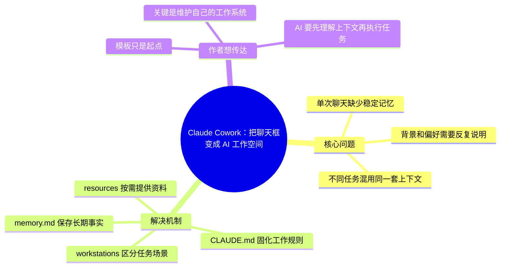

# My Simple Claude Cowork System (for normal people)

- 作者：Jeff Su
- 发布时间：2026-04-28
- 视频链接：https://www.youtube.com/watch?v=0_dSWLOHKng
- 信息边界：检测到英文自动字幕轨道，但当前环境下载字幕内容返回空。本摘要基于公开视频描述、章节和元数据生成。

## 快速理解

一句话结论：这期不是讲 Claude 的新模型能力，而是讲如何把 Claude 组织成一个能长期协作的 AI 工作空间。

简述：Jeff Su 展示的是一套 Claude Cowork 工作区架构。核心做法是把规则、记忆、资源和任务场景放进文件结构里，让 Claude 不是每次从零开始聊天，而是先进入一个有背景、有偏好、有任务边界的工作环境。

为什么值得关注：这期体现了 AI 产品形态的变化。AI 助手的价值不只来自模型本身，还来自它能否稳定管理上下文、长期记忆和任务资料。

建议行动：

- 把这期归类为 AI Workspace / 长期上下文 / Agent 工作区案例。
- 关注 Claude、ChatGPT、Cursor、Codex 这类工具如何处理规则文件、记忆和项目空间。
- 不必完整看视频，除非你想照着搭一套自己的 Claude Cowork 工作区。

## 思维导图

## 分节理解

### Chapter 1 · 00:00 - 03:39 · Claude Cowork 是什么

上下文摘要：开头先定义问题：Claude 本身已经能帮你写邮件、整理资料、生成草稿，但如果只靠聊天框，它很难持续知道你的背景、风格和当前任务状态。

作者观点：作者想强调，问题不在于 Claude 不够聪明，而在于我们通常把它当成一次性聊天工具使用。他希望观众把 Claude Cowork 理解成一个稳定工作环境：Claude 进入这个环境后，知道你的偏好、正在做的事、常用资料和输出标准。这样它更像长期协作的同事，而不是每次都要重新培训的助手。

原文线索：`from a chatbot into a full operating system`

### Chapter 2 · 03:39 - 11:01 · 三层结构：Root、Workstations、Projects

上下文摘要：中段开始讲工作区架构：根目录放全局规则和记忆，工作站负责某一类任务，项目保存更具体的上下文。

作者观点：作者的想法是，如果所有资料都堆在一起，AI 反而更难工作。他把工作空间分层，是为了让长期偏好和具体任务分开。Root 保存长期规则；Workstation 对应一类工作；Project 承载具体任务。这样 Claude 进入不同场景时，只需要拿到相关背景，而不是被无关材料干扰。

原文线索：`three-level hierarchy`

### Chapter 3 · 04:58 - 16:17 · CLAUDE.md、memory.md 和 resources

上下文摘要：作者重点讲 Root Level 和 Workstations 中的关键文件：CLAUDE.md 保存工作规则，memory.md 保存长期事实，resources 保存模板、风格、样例和资料。

作者观点：作者最在意的是把隐性知识变成显性资料。你的写作风格、邮件偏好、项目背景、常用模板，如果一直停留在脑子里，就只能靠你每次重复说明。他建议把这些长期有效的信息沉淀成文件，让 Claude 在任务开始前先读取它们。

原文线索：`CLAUDE.md instruction files`

### Chapter 4 · 17:06 - 18:44 · 用例展示

上下文摘要：后段展示 Email HQ、支出追踪、newsletter 草稿等用例。

作者观点：作者想证明，这套方法不是为了整理文件而整理文件，而是为了让 AI 输出更贴近真实工作。Email HQ 体现语气一致，支出追踪体现规则一致，newsletter 草稿体现个人风格一致。他希望观众看到，上下文系统搭好后，Claude 的输出会更像“懂你工作方式”的结果。

原文线索：`drafts that sound like me`

## 关键工具 / 产品

- Claude Cowork
- CLAUDE.md / memory.md
- Obsidian
- Cowork Toolkit

